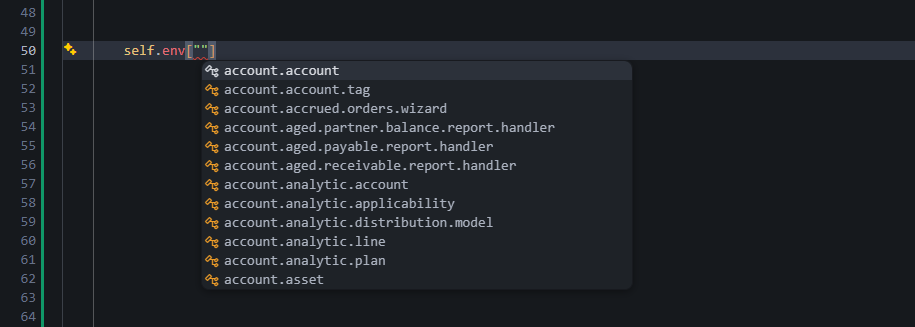

# Practical Guide: OdooLS in VSCode for Odoo

This guide documents a stable setup of **Odoo Language Server (OdooLS)** for Visual Studio Code with Python and XML support.

---

> [!NOTE]
> **Do you need to clone this repository?**
> 
> No! This repository is designed as a reference guide and configuration template. You do not need to clone the entire setup—simply copy the relevant configuration files (`odools.toml`, `pyrightconfig.json`) into your Odoo project root.

---

## Features in Action



---

## Prerequisites

Before starting, make sure you have the following ready:

* `Python` and `venv`: Ensure you have the Python version compatible with your target Odoo version installed (see Step 1).
* `Odoo source code repository` in a local path.
* `Visual Studio Code`.

* **VS Code Extensions**: The `Odoo` (OdooLS) extension installed (and optionally `Odoo Snippets`).


---

## 1. Create the language virtual environment

> [!IMPORTANT]
> **Python Version Compatibility:**
> Make sure to create the virtual environment using the exact Python version required by the target Odoo version you are developing for.
> Example:
> * **Odoo 18:** Python 3.10 – 3.12 (avoid Python 3.14+ as binary wheels are missing).

Creating a separate virtual environment for OdooLS helps the server resolve Odoo imports and dependencies using a controlled Python instance. OdooLS uses `python_path` from `odools.toml`, so this path must point to the correct interpreter within the virtual environment.

```bash
# Example for Odoo 18 using Python 3.12
python3.12 -m venv venv-odoo-18
```

---

## 2. Make the Odoo repo visible inside the environment

> [!NOTE]
> Before running this command, ensure your local Odoo repository is checked out to the correct version branch (e.g., `git checkout 18.0`).

If the virtual environment cannot "see" the Odoo source code, the server might start but fail on imports or contextual analysis. A practical method is to create a `.pth` file inside the environment's `site-packages` directory to add the Odoo repository to the Python path.

```bash
~/dev/venv-odoo-18/bin/python -c "import site; open(site.getsitepackages()[0] + '/odoo.pth', 'w').write('$HOME/odoo\n')"
```

---

## 3. Install Odoo dependencies in the environment

Installing the requirements from the Odoo repository inside the same virtual environment improves import resolution and reduces false positives.

> [!WARNING]
> * Ensure your Odoo repository is on the correct branch before installing requirements.


Install the requirements file:

```bash
~/dev/venv-odoo-18/bin/pip install -r ~/odoo/requirements.txt
```
---

## 4. Install the recommended VS Code extensions

To enhance your development workflow and enable language server support for Odoo in Visual Studio Code, install the required extension along with the recommended snippet package:

* **Odoo (OdooLS):** Required. Provides intelligent autocompletion, go-to-definition, and workspace analysis powered by the language server protocol. Search for `Odoo` in the VS Code Marketplace and install it.
* **Odoo Snippets:** Optional but recommended. Provides useful code templates and shortcuts for rapidly scaffolding Odoo models, views, fields, and security rules.

---

## 5. Create `odools.toml`

OdooLS is configured via an `odools.toml` file in the root of your project directory. This file defines `odoo_path`, `python_path`, `addons_paths`, and configuration profiles.

Recommended example:

```toml
[[config]]
name = "main"
odoo_path = "${userHome}/odoo"
python_path = "${userHome}/dev/venv-odoo-18/bin/python"
addons_paths = [
    "${workspaceFolder}/enterprise",
    "${workspaceFolder}/oca/contract",
    "${workspaceFolder}/addons"
]
```

### Notes on this file:

* `name = "main"` must match the profile selected in the LSP client (`selectedProfile = "main"`).
* `${userHome}` avoids hardcoding the system username.
* `${workspaceFolder}` allows reusing the file across different projects.

---

## 6. Complement with `pyrightconfig.json`

Although OdooLS provides Odoo-specific autocompletion and navigation, a `pyrightconfig.json` file helps with general Python imports and diagnostics.

Example:

```json
{
  "venvPath": "${HOME}/dev",
  "venv": "venv-odoo-18",
  "extraPaths": [
    "${HOME}/odoo",
    "${HOME}/odoo/odoo",
    "${HOME}/odoo/odoo/addons",
    "${HOME}/odoo/addons",
    "./enterprise",
    "./oca/contract",
    "./addons"
  ],
  "typeCheckingMode": "off"
}
```

---

## 7. Example project structure

```text
my-odoo-project/
├── .git/
├── odools.toml
├── pyrightconfig.json
├── addons/
├── oca/contract
└── enterprise/
```
